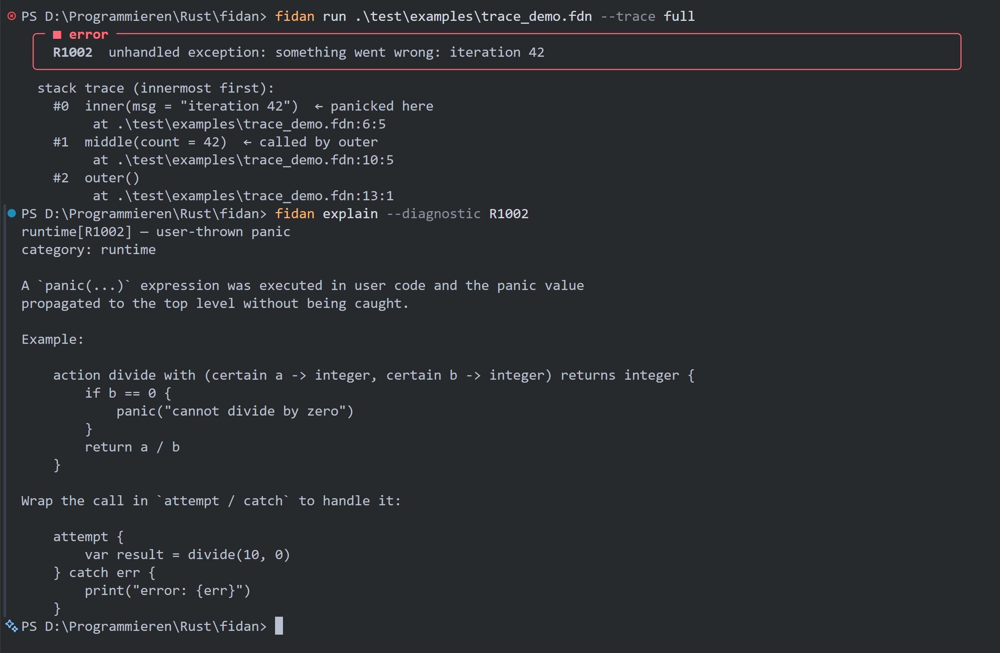
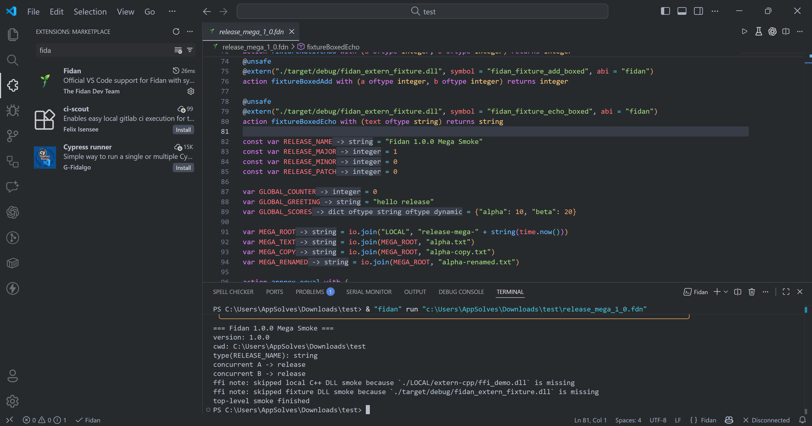

<div align="center">

<p align="center">
  
</p>

# Fidan

**An AI-native general-purpose programming language and compiler toolchain built for human-readable code, native backends, and compiler-grounded AI tooling.**

[](LICENSE) &nbsp; [](https://github.com/fidan-lang/fidan/actions/workflows/ci.yaml) &nbsp;  &nbsp; [](https://marketplace.visualstudio.com/items?itemName=fidan.fidan)

[Getting Started](#getting-started) • [Language Tour](#language-tour) • [CLI Reference](#cli-reference) • [Standard Library](#standard-library) • [VS Code Extension](#vs-code-extension) • [Contributing](#contributing)

</div>

---

## What is Fidan?

Fidan is an **AI-native general-purpose programming language and compiler toolchain**. Its human-readable, English-like syntax combines static type checking, type inference, nullable values, and explicit concurrency constructs.

Fidan is designed around the idea that AI development tools should understand programs through structured compiler knowledge, alongside source text. Its toolchain exposes diagnostics, inferred types, symbol information, reads/writes, call graphs, type maps, and static execution traces to first-party explain/fix/improve workflows and MCP tooling. This compiler-grounded integration is a central architectural direction of the project.

Implemented in Rust, the compiler lowers source through typed HIR and MIR optimization to a MIR interpreter with selective Cranelift JIT, Cranelift AOT, or optional LLVM AOT. The workspace also includes a formatter, LSP server, REPL, package tooling, and embedding APIs. See [AI-native tooling](#ai-native-tooling) for the analysis interfaces and provider requirements.

```fidan
object Person {
    var name oftype string
    var age  oftype integer

    new with (certain name oftype string, optional age oftype integer = 18) {
        this.name = name
        this.age  = age
    }

    action introduce returns nothing {
        print("My name is {this.name} and I am {this.age} years old!")
    }
}

action main {
    var john = Person("John" also 20)
    john.introduce()
    print("Hello, {john.name}!")
}

main()
```

Entry-point note: declaring `action main` does not auto-run by itself. Call
`main()` explicitly (as shown above). Declarations are hoisted, so actions can
still be called before their textual declaration in the same module.

---

## Project status

Fidan is an actively developed language implementation. Examples and regression tests exercise objects, control flow, collections, concurrency, native interop, and tooling. Language APIs and compiler behavior may evolve; the existence of a compiler stage does not imply complete support for every construct in every backend.

- `fidan run` executes MIR and can JIT eligible functions. Unsupported JIT functions stay in the interpreter. `--jit-threshold 0` disables JIT.
- `fidan build --backend cranelift` produces native executables using the Rust backend and a host linker.
- `fidan build --backend llvm` uses a separately installed LLVM helper. `--backend auto` prefers a compatible installed LLVM toolchain and otherwise uses Cranelift. `--release` selects optimization defaults, not a backend.
- AI explain/fix/improve requires the optional AI helper and a configured provider. Compiler analysis, diagnostics, formatting, and deterministic fixes do not require a model.
- Backend regression tests cover specific programs; general backend parity is not guaranteed. The interpreter's file/environment policy is not an OS security boundary for arbitrary native interop.

See [the engineering audit](docs/ENGINEERING_AUDIT.md) for verified configurations, dependency decisions, and remaining limitations.

---
## Getting Started

### Install from a published release

If you just want to use Fidan, you do not need to build the compiler from source.

Use the bootstrap script from this repository:

```bash
# Linux / macOS
curl -fsSL https://fidan.dev/install.sh | sh
```

```powershell
# Windows (PowerShell)
iwr https://fidan.dev/install.ps1 -UseBasicParsing | iex
```

The bootstrap scripts above download the latest published Fidan release for your host, install it into the standard Fidan install directory, and make the first installed version active.

On Windows, the bootstrap script and the Inno Setup installer automatically ensure the required Microsoft Visual C++ Redistributable is present before activating Fidan. The WinGet package also declares that dependency so WinGet can install it first when needed.

On Windows, each release cycle also ships an Inno Setup bootstrap installer and submits a matching WinGet package update.

```powershell
# Windows (Winget)
winget install --id Fidan.Fidan --exact
```

For the Inno Setup installer asset (`fidan_windows_bootstrap_v<release>.exe`):

- the `Version` bootstrap parameter defaults to the installer's own release version
- you can override that default to the newest release by setting version to `latest`
- unattended override example: `/VERSION=latest`

Published archives are also available from GitHub Releases if you prefer downloading them manually:

- https://github.com/fidan-lang/fidan/releases

Stable release archives also ship the `libfidan` embedding bundle:

- the platform `libfidan` shared library
- the platform `libfidan` static library
- `include/fidan.h`
- a tiny C embedding example under `examples/embed_c/`

On Windows, manual `.tar.gz` extraction still assumes the Microsoft Visual C++ Redistributable for your architecture is already installed on the machine.

For Rust hosts built from source, the workspace also includes a small safe
wrapper crate:

- `crates/fidan-embed`

After bootstrap install, verify it with:

```bash
fidan --version
```

#### Updates and uninstall

To install or refresh the latest published version:

```bash
fidan self install
```

To switch to the newest installed version:

```bash
fidan self use
```

To uninstall:

```bash
fidan self remove
```

`fidan self install` defaults to `latest`, so you only need to pass an explicit version when installing or refreshing a specific release.

### Build from source

#### Prerequisites

- **Rust 1.96 or newer**: [rustup.rs](https://rustup.rs). The locked Cranelift 0.136 dependencies require this compiler version; this release was tested with Rust 1.99. Use `--locked` for reproducible builds. Future dependency updates may require a newer compiler.
- A native linker/toolchain: Visual Studio C++ Build Tools on Windows, Xcode Command Line Tools on macOS, or a C compiler/linker on Linux. Native interop tests compile C/C++ fixtures.
- On Linux, install `pkg-config` and `libdbus-1-dev` (Debian/Ubuntu names) for the OS keyring backend. Headless commands that do not access the keyring can run without a Secret Service session.

```bash
git clone https://github.com/fidan-lang/fidan.git
cd fidan
cargo build --workspace --release --locked
```

The `fidan` binary will be at `target/release/fidan`. Add it to your `PATH`:

```bash
# Linux / macOS
export PATH="$PWD/target/release:$PATH"

# Windows (PowerShell)
$env:PATH = "$PWD\target\release;" + $env:PATH
```

### Verify installation

```bash
fidan --version
```

### Embedding with `libfidan`

If you are embedding Fidan into another host application, use the `libfidan`
artifacts shipped in the stable release archives rather than linking directly
against the internal workspace crates.

Current embedding contract:

- create a VM with `fidan_vm_new()`
- evaluate source or a file with `fidan_eval()` / `fidan_eval_file()`
- inspect values through the `fidan_value_*` helpers
- free returned values with `fidan_value_free()`

The initial `libfidan` slice returns the top-level `result` binding when the
program defines one. If no `result` binding exists, a successful run returns
`nothing`.

For Rust embedders working from the repository, `crates/fidan-embed` wraps the
raw C ABI with safe `Vm` / `Value` types and `Result`-based error handling.

---

## Quick Start

Create a file `hello.fdn`:

```fidan
print("Hello, world!")
```

Run it:

```bash
fidan run hello.fdn
```

---

## Language Tour

### Variables and types

```fidan
var name    = "Alice"             # inferred: string
var age     = 30                  # inferred: integer
var score   = 9.5                 # inferred: float
var active  = true                # inferred: boolean
var nothing_here = nothing        # nothing (null)

var count oftype integer          # declared, not yet assigned — defaults to nothing
var pi oftype float = 3.14159     # explicit type + value
```

Types can be inferred from expressions or declared with `oftype`; the type checker validates explicit annotations.

Integers are signed 64-bit values. Addition, subtraction, multiplication,
negation, and integer powers report runtime error `R2003` when the result cannot
be represented. Integer division truncates toward zero; `MIN / -1` and `MIN % -1`
also report `R2003`. Division and remainder by zero report `R2001`.
Integer `abs` also reports `R2003` for `MIN`, whose magnitude cannot fit in i64.
Negative integer powers remain integers for bases `1` and `-1`; a zero base
reports `R2001`, and other bases produce a floating-point reciprocal power. The runnable
[integer arithmetic regression](test/examples/integer_overflow_regression.fdn)
checks boundaries and catchable errors through the interpreter and native backends.

String lengths, bracket indices, slices, `indexOf`, and `lastIndexOf` count Unicode
scalar values. Receiver `substring`, `substr`, and `slice` use half-open character
ranges: bounds clamp to `[0, len]`, and reversed bounds return an empty string.
Receiver `charAt` returns an empty string for negative or out-of-range positions.
Bracket access supports negative indices and reports `R2002` for invalid indices;
bracket slicing also supports negative bounds and steps.

Multi-line strings are supported directly in both normal and raw string literals. Normal strings still process escapes and interpolation; raw strings preserve the body verbatim.

```fidan
var plain = "First line
Second line
Third line"

var raw = r"alpha
{value}
omega"

var name = "Ada"
var interp = "Hello,
{name}!
Done."
```

For a runnable smoke example, use [test/examples/multiline_strings.fdn](test/examples/multiline_strings.fdn):

```bash
fidan run test/examples/multiline_strings.fdn
fidan build --backend cranelift test/examples/multiline_strings.fdn
fidan build --backend llvm test/examples/multiline_strings.fdn
```

---

### Actions (functions)

```fidan
action greet with (certain name oftype string) returns string {
    return "Hello, {name}!"
}

print(greet("Fidan"))  # Hello, Fidan!
```

- `certain` means the parameter must be non-null at call time — enforced at compile time
- `optional` (default) parameters can be `nothing`
- Parameters can use `also` or `,` as separators

Named arguments work at every call site:

```fidan
action create_user with (certain name oftype string, optional age oftype integer = 18) {
    print("{name} is {age} years old")
}

create_user(name set "Alice", age = 25)   # both forms work
create_user("Bob")                         # positional, age defaults to 18
```

---

### Objects and inheritance

```fidan
object Animal {
    var sound oftype string

    new with (certain sound oftype string) {
        this.sound = sound
    }

    action speak returns string {
        return "I say: {this.sound}"
    }
}

object Dog extends Animal {
    var name oftype string

    new with (certain name oftype string) {
        this.name = name
        parent(sound set "Woof")
    }

    action fetch returns nothing {
        print("{this.name} fetches the ball!")
    }
}

var rex = Dog("Rex")
print(rex.speak())   # I say: Woof
rex.fetch()          # Rex fetches the ball!
```

Extension actions let you add methods to existing objects without modifying them:

```fidan
action bark extends Dog {
    print("{this.name} goes WOOF WOOF!")
}

rex.bark()
```

---

### Control flow

```fidan
# if / otherwise when / else
if age greaterthan 18 {
    print("Adult")
} otherwise when age equals 18 {
    print("Just turned 18!")
} else {
    print("Minor")
}

# Synonyms: use whichever reads most naturally
if score > 9 and score <= 10 {
    print("Excellent")
}
```

Ternary expressions:

```fidan
var label = "pass" if score >= 5 else "fail"

# Implicit-subject shorthand (Fidan-specific)
var display = person if is not nothing else defaultPerson
# Equivalent to:
var display = person if (person != nothing) else defaultPerson
# Or simply:
var display = person ?? defaultPerson    # null-coalescing operator
```

---

### Loops

```fidan
# for with range (exclusive)
for i in 1..10 {
    print(i)
}

# for with inclusive range
for i in 1...10 {
    print(i)
}

# for over a list
var fruits = ["apple", "banana", "cherry"]
for fruit in fruits {
    print(fruit)
}

# while
var n = 0
while n < 5 {
    n += 1
}
```

---

### Check (pattern matching)

```fidan
var code = 404

check code {
    200 => print("OK")
    404 => print("Not found")
    500 => print("Server error")
    _   => print("Unknown code: {code}")
}

# Inline check expression
var message = check code {
    200 => "OK"
    404 => "Not found"
    _   => "Other"
}
```

---

### String interpolation

```fidan
var name = "Fidan"
var version = 1

print("Welcome to {name} v{version}!")       # simple variable
print("2 + 2 = {2 + 2}")                     # expression
print("{name.upper()} is awesome!")           # method call
print("Pi is approximately {floor(3.14159)}") # function call
```

Nested multi-line comments are fully supported:

```fidan
#/
    This is a comment.
    #/ And this is nested. /#
    Still in the outer comment.
/#
```

---

### Indexing and slicing

Strings use Unicode character indices; lists and lazy integer ranges use element indices. Negative indices count from the end. Slice endpoints are clamped and the stop is exclusive:

```fidan
var text = "somestring"
assert_eq(text[1:4], "ome")
assert_eq(text[:4], "some")
assert_eq(text[3:], "estring")
assert_eq(text[:], text)
assert_eq(text[::2], "smsrn")
assert_eq(text[1:7:2], "oet")
assert_eq(text[::-1], "gnirtsemos")
```

The default step is `1`. For negative steps, omitted bounds run from the last character to before the first; an explicit `-1` stop refers to the last character. `nothing` components use the omitted-bound defaults. A zero step or a non-integer bound reports an error. Strings count Unicode scalar values, not grapheme clusters.

Existing syntax remains available: `text[1..4]`, `text[.. step 2]`, and `text[1...4]` (inclusive stop). The formatter canonicalizes exclusive slices to colon syntax, including legacy `..`/`step` aliases. Inclusive `...` slices retain their compatibility spelling because converting dynamic inclusive bounds could change behavior. Ordinary ranges keep their spelling. See [the slicing regression example](test/examples/slice_regression.fdn) for executable cases shared by the backend tests.

File paths in `std.io` and `std.json` resolve relative to the process working directory, not the source file's directory. For example, running `fidan run LOCAL/test_file_manager.fdn` from the repository root reads/writes `./tasks.json` in that root. `io.cwd()` shows the working directory; `io.join(...)` builds a platform path. `io.file_exists(path)` returns `false` for missing paths and reports other filesystem inspection failures.

### Integer arithmetic and powers

Signed 64-bit addition, subtraction, multiplication, negation and nonnegative integer powers are checked. Overflow reports `R2003`; division or modulo by zero reports `R2001`. `i64::MIN / -1` and `i64::MIN % -1` report overflow without a host trap.

Integer bases accept negative integer exponents: `2 ** -3` is the float `0.125`. Unit bases preserve exact integer results (`1 ** -999` is `1`; `(-1) ** -3` is `-1`). Zero raised to a negative exponent reports `R2001`. Constants can prove Integer/Float result types; otherwise integer/integer exponentiation uses flexible values because its result category depends on runtime operands.

`std.test.assert_eq` applies its float tolerance recursively through lists, tuples and dictionaries. Collection `contains`/`find` use exact structural value equality, without test-helper tolerance.

### Error handling

```fidan
attempt {
    var data = readFile("config.json")
    print(data)
} catch error {
    print("Failed: {error}")
} otherwise {
    print("File read successfully.")    # runs only when no error
} finally {
    print("Cleanup always runs.")
}
```

You can annotate the error type:

```fidan
attempt {
    riskyOperation()
} catch error -> string {
    print("Got a string error: {error}")
}
```

---

### Concurrency and parallelism

Fidan has three concurrency models:

#### `spawn` / `await` — explicit same-thread async

```fidan
action fetch_data with (certain url oftype string) returns string {
    # ... HTTP call ...
    return "data from {url}"
}

var handle1 = spawn fetch_data("https://api.example.com/users")
var handle2 = spawn fetch_data("https://api.example.com/posts")

var users = await handle1
var posts = await handle2
print("Got {users} and {posts}")
```

`spawn` is lazy: the task is scheduled on the current thread and runs at
`await`/join checkpoints. Same-thread tasks are driven by a cooperative FIFO
scheduler, so `concurrent` blocks and nested `spawn`/`await` yield to other
ready same-thread tasks instead of starting OS threads.

#### `parallel` block — run tasks simultaneously

```fidan
parallel {
    task { heavyComputation() }
    task { processBigFile("data.csv") }
    task { renderChart() }
}
# All three tasks ran in parallel — execution continues here when all finish
```

#### `parallel for` — parallel iteration

```fidan
parallel for item in largeDataset {
    processItem(item)   # each item processed on a separate thread
}
```

#### `concurrent` block — structured same-thread tasks

```fidan
concurrent {
    task { readFromDatabase() }
    task { callExternalAPI() }
}
```

`concurrent` is cooperative and same-thread: it shares the caller thread,
preserves normal mutable-state semantics, and lets `await` yield to sibling
ready tasks in the block.

If you want an ordering sanity check, this pattern should interleave
predictably in `concurrent` and remain non-deterministic in `parallel`:

```fidan
use std.async

concurrent {
    task {
        print("A before")
        await async.sleep(10)
        print("A after")
    }
    task {
        print("B before")
        await async.sleep(1)
        print("B after")
    }
}

parallel {
    task { print("parallel 1") }
    task { print("parallel 2") }
}
```

#### `Shared` — thread-safe shared state

```fidan
var counter = Shared(0)
parallel {
    task inc1 {
        counter.update(action with (value) { return value + 1 })
    }
    task inc2 {
        counter.update(action with (value) { return value + 1 })
    }
}
print(counter.get())   # 2, after both tasks join
```

`get()` and `set()` synchronize individual accesses. A separate get followed by set, such as `counter.set(counter.get() + 1)`, is not an atomic read-modify-write. `update(callback)` holds the Shared mutex while calling the action with the current value and replacing it with the result. It returns the new value. Named actions, inline actions, and captured closures use the normal callable dispatch.

```fidan
var counter = Shared(0)
parallel for i in 1..100 {
    counter.update(action with (value) { return value + 1 })
}
assert_eq(counter.get(), 99)
```

An update callback must not call get/set/update on the same Shared value, including through an alias or upgraded WeakShared: same-thread recursive access reports R0001 instead of deadlocking. JSON serialization of that value also reports an error; string formatting shows a locked marker. If the callback throws, the stored value is not replaced and the lock is released; callback side effects are not rolled back. Avoid waiting for tasks that need the held Shared value, and use a consistent lock order when callbacks access multiple Shared values to prevent cross-thread deadlocks. The compiler rejects unsafe direct writes to non-Shared globals in parallel work with E0401.

---

### Null safety

```fidan
action divide with (certain a oftype integer, certain b oftype integer) returns float {
    return a / b
}

divide(10, 0)    # runtime panic — but never a null pointer crash
divide(nothing, 5)  # compile-time error — `certain` blocks this
```

Variables default to `nothing`. The null-safety pass (`W2006`) warns whenever a possibly-null value is used in an unsafe context:

```fidan
var name oftype string   # nothing by default
print(name.upper())      # W2006: `name` may be nothing here
```

---

### List and dict comprehensions

```fidan
var numbers = [1, 2, 3, 4, 5]

var doubled = [x * 2 for x in numbers]             # [2, 4, 6, 8, 10]
var evens   = [x for x in numbers if x % 2 == 0]  # [2, 4]
var squares = [x * x for x in 1..6]               # [1, 4, 9, 16, 25]

# Dict comprehension
var sq_map = {x: x * x for x in numbers}          # {"1": 1, "2": 4, ...}
var filtered_map = {x: x * 2 for x in numbers if x > 2}
```

---

### Built-in test blocks

No test framework to install. Tests live in your source files:

```fidan
action add with (certain a oftype integer, certain b oftype integer) returns integer {
    return a + b
}

test "basic addition" {
    assert(add(2, 3) == 5)
    assert_eq(add(0, 0), 0)
    assert_ne(add(1, 1), 3)
}

test "negative numbers" {
    assert_eq(add(-5, 5), 0)
    assert(add(-10, -10) < 0)
}
```

Run them with `fidan test yourfile.fdn`. Each test reports pass/fail with coloured output.

---

### Decorators

```fidan
@precompile        # JIT-compile this action at startup (eager, not lazy)
action fibonacci with (certain n oftype integer) returns integer {
    if n <= 1 { return n }
    return fibonacci(n - 1) + fibonacci(n - 2)
}

@deprecated("Use fibonacci2 instead")
action fibonacci_old with (certain n oftype integer) returns integer {
    # ...
}
```

---

### Native interop with `@extern`

Fidan can import native functions from shared libraries through `@extern`.

```fidan
@extern("./mylib.dll", symbol = "add_i64")
action addNative with (a oftype integer, b oftype integer) returns integer

assert_eq(addNative(20, 22), 42)
```

Native ABI `@extern` currently supports:

- arbitrary numbers of parameters
- parameter types: `integer`, `float`, `boolean`, `handle`
- return types: `integer`, `float`, `boolean`, `nothing`, `handle`

Example with mixed native types:

```fidan
@extern("./mylib.dll", symbol = "mix_values")
action mixValues with (
    a oftype integer,
    b oftype float,
    c oftype boolean,
    d oftype handle
) returns integer

assert_eq(mixValues(7, 8.0, true, 9), 124)
```

For richer values such as strings, lists, dicts, tuples, or dynamic objects, use the boxed Fidan ABI:

```fidan
@unsafe
@extern("./mylib.dll", symbol = "echo_boxed", abi = "fidan")
action echoBoxed with (text oftype string) returns string
```

`@extern` rules:

- `@extern` actions must be top-level and must omit their body
- native ABI is for scalar types only
- `abi = "fidan"` requires `@unsafe`
- `@precompile` cannot be combined with `@extern`
- `parallel action` cannot be combined with `@extern`

For AOT builds, add `link = "..."` so the native import library is available at link time:

```fidan
@extern("./mylib.dll", symbol = "add_i64", link = "./mylib.lib")
action addNative with (a oftype integer, b oftype integer) returns integer
```

Runnable native interop fixtures are in `crates/fidan-extern-fixture`. Run `cargo test -p fidan-driver --test extern_e2e` to exercise scalar and boxed calls, including AOT linking.

---

### Imports and modules

```fidan
# Standard library modules
use std.io
use std.math
use std.math.{sqrt, floor, ceil}
use std.collections

# User modules (file-relative)
use mymodule              # → mymodule.fdn or mymodule/init.fdn
use utils.helpers         # → utils/helpers.fdn

# Aliased import
use "./other.fdn" as other

# Re-export
export use std.math       # consumers of this module also get std.math
```

---

### JIT compilation

Hot functions are automatically JIT-compiled by Cranelift after a configurable number of calls (default: 500). You can force eager compilation:

```fidan
@precompile
action hot_inner_loop with (certain n oftype integer) returns integer {
    var sum = 0
    for i in 0..n { sum += i }
    return sum
}
```

Or tune from the CLI:

```bash
fidan run app.fdn --jit-threshold 100    # compile after 100 calls
fidan run app.fdn --jit-threshold 0     # disable JIT entirely
```

## Short runnable examples

- Concurrency split and expected behavior: `test/examples/concurrency_showcase.fdn`
- Hoisting behavior (call before declaration): `test/examples/hoisting_showcase.fdn`
- Inline tests: `test/examples/test_blocks.fdn`
- Profiling and `@precompile`: `test/examples/profiling_showcase.fdn`

Try them directly:

```bash
fidan run test/examples/concurrency_showcase.fdn
fidan run test/examples/hoisting_showcase.fdn
fidan test test/examples/test_blocks.fdn
fidan profile test/examples/profiling_showcase.fdn
```

---

## AI-native tooling

AI-native in Fidan means giving AI development tools structured compiler information to reason about programs. The first-party analysis path uses the parser and type checker to build that context; the optional AI helper connects it to model providers and exposes it through MCP.

The deterministic analysis path can produce structured context for a file or line range:

- selected source text
- diagnostics and stable diagnostic codes
- inferred types
- reads and writes
- line-level risk notes such as possible division by zero or out-of-bounds access
- module outline and imports
- related symbols
- call graph
- type map
- static execution trace

These analyses describe source structure and compiler-inferred information. Static traces walk source statements and provide value hints; they do not record an actual execution. Types can remain unknown, and source-level call graphs do not establish complete runtime call coverage.

That context feeds the optional AI analysis toolchain used by `explain --ai`, `fix --ai`, `fix --improve`, and editor commands.

```bash
fidan toolchain add ai-analysis
fidan exec ai setup
fidan exec ai doctor

fidan explain app.fdn --line 42 --ai "focus on data flow"
fidan fix app.fdn --ai --in-place
fidan fix app.fdn --improve "simplify without changing behavior" --in-place
fidan exec ai mcp
```

The AI toolchain supports OpenAI-compatible APIs, Anthropic, local Ollama or LM Studio endpoints, and custom OpenAI-compatible endpoints. API keys can be stored through the OS keychain or supplied through environment variables.

`fix --ai` and `fix --improve` return structured hunks with exact old/new text and reasons. The CLI validates hunks before applying them, rejects empty or no-op edits, and still runs deterministic compiler fixes first. This keeps AI assistance inside a reviewable source-editing workflow instead of bypassing the compiler.

The built-in MCP mode exposes the same compiler-grounded context to compatible AI clients:

```bash
fidan exec ai mcp
```

---

## CLI Reference

```
fidan <COMMAND> [OPTIONS] [FILE]
```

| Command | Description |
|---|---|
| `fidan run <file>` | Run a Fidan source file |
| `fidan build <file>` | Compile to a native binary |
| `fidan check <file>` | Type-check and lint without running |
| `fidan fix <file>` | Auto-apply high-confidence fixes |
| `fidan format <file>` | Format source code |
| `fidan test <file>` | Run inline `test {}` blocks |
| `fidan profile <file>` | Run with profiling output |
| `fidan repl` | Start the interactive REPL |
| `fidan lsp` | Start the Language Server (used by editors) |
| `fidan explain --diagnostic <code>` | Show detailed explanation of a diagnostic code |
| `fidan explain <file> --line N` | Explain what line N does (static analysis) |
| `fidan new <name>` | Scaffold a new Fidan project |
| `fidan new <name> --package` | Scaffold a Dal-ready package with `dal.toml` and `src/init.fdn` |
| `fidan self <command>` | Install, switch, list, and remove self-managed Fidan versions |
| `fidan toolchain <command>` | Install and inspect optional toolchains such as LLVM and AI analysis |
| `fidan exec <namespace>` | Run commands registered by installed toolchains, such as `fidan exec ai ...` |
| `fidan dal <command>` | Work with the Dal package registry |

`fidan format` behavior:

- default mode prints formatted source to stdout and does not modify the file
- `--in-place` rewrites the file on disk
- `--check` exits with status 1 when formatting changes are required

`fidan new` scaffolds `main.fdn` with an explicit `main()` call so the entry
behavior is obvious in new projects.

### `fidan dal` commands

| Command | Description |
|---|---|
| `fidan dal login` | Store a Dal API token in the OS keychain for CLI use |
| `fidan dal logout` | Remove the stored Dal API token from the OS keychain |
| `fidan dal whoami` | Show the authenticated Dal account |
| `fidan dal search <query>` | Search packages on Dal |
| `fidan dal info <package>` | Show package metadata and published versions |
| `fidan dal add <package>` | Download and vendor a package into a local importable module directory |
| `fidan dal remove <package>` | Remove a local or global package install |
| `fidan dal package [path]` | Validate the package layout locally and build a canonical Dal `.tar.gz` archive |
| `fidan dal publish [path]` | Run the same local validation, build the archive, and publish it to Dal |
| `fidan dal yank <package> <version>` | Yank a published version |
| `fidan dal unyank <package> <version>` | Unyank a published version |

`fidan dal add` installs packages into an import-safe local module directory.
For example, a Dal package named `my-package` is installed so you can import it
in Fidan as:

```fidan
use my_package
```

Package requests can include semver constraints and feature selections:

```bash
fidan dal add my-package[json,cli] --version "^1.2"
fidan dal add my-tool --global
```

Dal resolves dependencies into `dal.lock`, supports optional dependencies through feature wiring, and can install package-provided CLI entries declared in `[cli]` metadata.

Dal token lookup order:

1. `--token` argument to `fidan dal login`
2. `FIDAN_DAL_API_TOKEN` environment override
3. OS keychain / credential manager

Registry lookup order:

1. `--registry`
2. `FIDAN_DAL_REGISTRY`
3. default: `https://api.dal.fidan.dev`

Dal package preflight validation happens locally before archive creation or upload. A package must contain:

- `dal.toml`
- `src/init.fdn`
- only allowed top-level entries such as `README*`, `LICENSE*`, `CHANGELOG.md`, `src/`, `examples/`, `tests/`, `docs/`, and `assets/`
- no symlinks, path traversal, or unsafe archive paths

### `fidan run` flags

| Flag | Description |
|---|---|
| `--reload` | Watch source files and re-run on change |
| `--strict` | Treat select warnings as errors |
| `--trace short\|full\|compact` | Show call stack on panic |
| `--jit-threshold N` | JIT after N calls (0 = off) |
| `--sandbox` | Deny file and environment access by default |
| `--allow-read <paths>` | Whitelist read paths (sandbox mode) |
| `--allow-write <paths>` | Whitelist write paths (sandbox mode) |
| `--allow-env` | Allow environment variable access (sandbox) |
| `--time-limit <secs>` | Hard wall-time limit |
| `--mem-limit <mb>` | Hard memory limit |
| `--max-errors N` | Stop after N errors |
| `--suppress W1005,W2006` | Suppress specific diagnostic codes |
| `--emit tokens\|ast\|hir\|mir` | Dump an intermediate representation |
| `--replay <id\|path>` | Replay a captured crash scenario |

### `fidan build` flags

| Flag | Description |
|---|---|
| `--output <path>` | Output binary path |
| `--release` | Enable the release preset (`O3`, full LTO, strip all, native CPU unless overridden) |
| `--opt O0\|O1\|O2\|O3\|Os\|Oz` | Select optimization level |
| `--lto off\|full` | Control link-time optimization |
| `--strip off\|symbols\|all` | Control symbol stripping |
| `--backend auto\|cranelift\|llvm` | Select native backend |
| `--target-cpu <spec>` | Use `generic`, `native`, a CPU name, or a CPU plus feature string where supported |
| `--lib-dir <path>` | Add native library search path for AOT linking |
| `--link-runtime static\|dynamic` | Choose runtime linkage mode |
| `--linker <path-or-name>` | Override the linker used for AOT output |
| `--emit tokens\|ast\|hir\|mir\|obj` | Dump intermediate representation or object output |

### `fidan self`, `fidan toolchain`, and `fidan exec`

Fidan can manage its own installed versions and optional toolchains from the same CLI.

```bash
fidan self list
fidan self install
fidan self use
fidan self remove

fidan toolchain available
fidan toolchain add llvm
fidan toolchain add ai-analysis
fidan toolchain list

fidan exec ai help
fidan exec ai setup
fidan exec ai doctor
fidan exec ai mcp
```

Optional toolchains are versioned release artifacts with compatibility metadata. The LLVM toolchain powers `fidan build --backend llvm`; the AI analysis toolchain powers model-backed explain/fix/improve workflows and exposes the `ai` exec namespace.

### Hot reload

```bash
fidan run app.fdn --reload
# [↻ reload] app.fdn changed — re-running
```

Any `.fdn` file in the same directory triggers a re-run. Useful during development.

### Replay-based crash reproduction

When your program crashes and it read from stdin, Fidan saves the input sequence:

```
error[R0001]: division by zero
  → replay.fdn:7

  hint: fidan run replay.fdn --replay a3f82c91
```

Run that command to reproduce the exact crash, every time, without re-typing inputs.

### REPL

```bash
fidan repl
>>> var x = 10
>>> x * x
100
>>> :type x * x
: integer
>>> :last
R0001: division by zero at line 3
>>> :last --full
... full error history ...
```

The REPL supports multi-line input, continuation prompts (`...`), `:cancel` to abort a block, and `:type <expr>` to inspect inferred types.

### `fix` — deterministic and AI-assisted source edits

```bash
fidan fix app.fdn
fidan fix app.fdn --in-place
fidan fix app.fdn --ai
fidan fix app.fdn --ai "preserve public API" --in-place
fidan fix app.fdn --improve "reduce duplication" --in-place
```

The default mode prints the proposed result so you can review it first. `--in-place` rewrites the file.

Deterministic high-confidence fixes always run first. With the AI analysis toolchain installed, `--ai` asks for additional diagnostic-oriented repairs and `--improve` / `--refactor` asks for behavior-preserving cleanups. AI edits are returned as exact hunks and validated before application.

### `explain` — static analysis on demand

```bash
fidan explain app.fdn            # explain the whole file
fidan explain app.fdn --line 42
fidan explain app.fdn --end-line 20
fidan explain app.fdn --line 10 --end-line 20
fidan explain app.fdn:42-45 # alias for range form
fidan explain file.fdn --ai # AI-powered explanation of the whole file (requires toolchain)
fidan explain --diagnostic E0401
fidan explain --last-error
```

For each line in range, Fidan reports:
- **What it does** (plain-English description)
- **Inferred type** of the expression
- **Reads** (variables accessed)
- **Writes** (variables modified)
- **Could go wrong** (division by zero, out-of-bounds index, overflow…)

---

## Diagnostic System

Fidan's diagnostics are designed to be read, not feared.



Every diagnostic includes:
- **Source context** — the offending line(s) with line numbers
- **Inline caret** — exactly which token is wrong and why
- **Fix-it patch** — a green `+` block showing the corrected version where applicable
- **Cause chain** — if error A caused error B, both are shown linked
- **`fidan fix`** — automatically applies all high-confidence patches

Diagnostic codes:

| Prefix | Category | Example |
|---|---|---|
| `E01xx` | Undefined names / scoping | `E0101` unknown name |
| `E02xx` | Type mismatches | `E0201` type mismatch on assignment |
| `E03xx` | Call errors | `E0301` missing required argument |
| `E04xx` | Parallelism / data race | `E0401` shared write in parallel block |
| `E02xx` | Null safety | `E0205` non-null operand used as null |
| `W10xx` | Code quality | `W1005` unused import |
| `W20xx` | Null safety warnings | `W2006` possibly-null dereference |
| `W50xx` | Performance hints | `W5001` dynamic type in hot loop |
| `R9xxx` | Runtime errors | `R9001` parallel task failed |

```bash
fidan explain --diagnostic E0401    # print a full page of documentation for this code
```

---

## Standard Library

| Module | What it provides |
|---|---|
| `std.async` | Same-thread `Pending` helpers: `sleep`, `ready`, `gather`, `waitAny`, `timeout` |
| `std.collections` | `range`, `hashset`, `Queue`, `Stack`, `zip`, `enumerate`, `chunk`, `window`, `partition`, `groupBy`, reducers, set operations |
| `std.env` | Environment variable access and script arguments |
| `std.io` | Console I/O, files, directories, paths, environment convenience, terminal helpers |
| `std.json` | Parse, validate, stringify, pretty-print, read, and write JSON with soft-error mode |
| `std.math` | `sqrt`, `abs`, `floor`, `ceil`, `round`, `pow`, `log`, trig, randomness, numeric predicates, constants |
| `std.regex` | Match, find, capture, replace, split, and validate regular expressions |
| `std.string` | Casing, trimming, splitting, joining, replacing, slicing, padding, parsing, character/codepoint helpers |
| `std.test` | `assert`, `assertEq`, `assertNe`, ordering/type/nothing assertions, `fail`, `skip` |
| `std.parallel` | `parallelMap`, `parallelFilter`, `parallelForEach`, `parallelReduce` |
| `std.time` | `sleep`, timestamps, duration helpers |

Usage:

```fidan
use std.math.{sqrt, PI}
use std.collections

var stack = Stack()
stack.push(1)
stack.push(2)
print(stack.pop())   # 2

print(sqrt(144))     # 12.0
print(PI)            # 3.141592653589793
```

---

## VS Code Extension



The extension is distributed separately through the [VS Code Marketplace](https://marketplace.visualstudio.com/items?itemName=fidan.fidan); its source and setup instructions live in [fidan-editors](https://github.com/fidan-lang/fidan-editors).

This repository contains the `fidan lsp` server, with diagnostics, completion, hover, signature help, navigation, references, rename, formatting, inlay hints, code actions, folding, and semantic tokens. Editor integration depends on the extension version; extension packaging and commands are maintained in the editor repository.

---

## Architecture

Fidan is written in Rust and organized as a Cargo workspace of focused crates:

```
Source -> lexer/parser -> AST -> type checking -> typed HIR -> MIR -> passes
                                                               |
                                     +-------------------------+-------------------+
                                     |                         |                   |
                              MIR interpreter           Cranelift AOT          LLVM AOT
                              + selective JIT           (host linker)         (optional helper)
```

All execution paths consume MIR. Native backends call the shared Rust runtime for boxed values, collections, slicing, and standard-library operations. The JIT supports a subset of MIR and falls back per function; AOT builds report unsupported lowering rather than promising universal parity.
| Crate | Role |
|---|---|
| `fidan-config` | Shared language metadata for builtins, decorators, types, aliases, and receiver methods |
| `fidan-source` | `SourceFile`, `Span`, `SourceMap` |
| `fidan-lexer` | Tokenizer, synonym normalization |
| `fidan-ast` | All AST node types, arena allocator |
| `fidan-parser` | Recursive-descent + Pratt expression parser |
| `fidan-secrets` | OS keychain / credential storage helpers used by registry and AI tooling |
| `fidan-diagnostics` | Diagnostic types, terminal/source rendering, fix engine, stable code explanations |
| `fidan-typeck` | Symbol tables, type inference, null-safety, data-race detection |
| `fidan-hir` | Typed, desugared high-level IR |
| `fidan-mir` | SSA-form mid-level IR, CFG |
| `fidan-passes` | Optimization and analysis passes |
| `fidan-runtime` | Value model, COW collections, object model, `Shared<T>` |
| `fidan-interp` | MIR tree-walking interpreter |
| `fidan-extern-fixture` | Native interop test fixture library |
| `libfidan` | C ABI embedding surface |
| `fidan-embed` | Safe Rust wrapper around `libfidan` |
| `fidan-codegen-cranelift` | Cranelift JIT and AOT backends |
| `fidan-codegen-llvm` | LLVM AOT backend |
| `fidan-llvm-helper` | Packaged helper binary for the optional LLVM toolchain |
| `fidan-ai-analysis-helper` | Packaged helper binary for AI explain/fix/improve and MCP workflows |
| `fidan-stdlib` | Rust-backed standard library |
| `fidan-driver` | Compiler driver and CLI-facing orchestration across frontends/backends/toolchains |
| `fidan-fmt` | Canonical source formatter |
| `fidan-lsp` | LSP server: diagnostics, completion, navigation, semantic tokens, and formatting |
| `fidan-cli` | `fidan` binary — all subcommands |

---

## Contributing

Contributions are welcome! By submitting a pull request or patch you acknowledge that you have read [CONTRIBUTING.md](CONTRIBUTING.md) — your contribution becomes part of the Fidan project under its license terms.

1. Fork the repository
2. Create a feature branch (`git checkout -b feature/my-feature`)
3. Make your changes and ensure `cargo test --workspace` passes
4. Open a pull request with a clear description

Please sign the CLA before your first PR is merged (the bot will prompt you automatically).

### Git hooks

This repository ships git hooks in `.githooks`.

Install them after cloning:

```powershell
.\scripts\install-git-hooks.ps1
```

That script sets `core.hooksPath` to `.githooks` for this repository.

You can verify the hook path with:

```powershell
git config --get core.hooksPath
```

The current `pre-commit` hook automatically runs `cargo fmt --all` when staged `.rs` files are present, then re-stages the formatted files for you.

**Development setup:**

```bash
# Build all crates (LLVM itself is optional)
cargo build --workspace --locked

# Run all tests
cargo test --workspace --locked

# Formatting and lint checks
cargo fmt --all --check
cargo clippy --workspace --all-targets --locked -- -D warnings

# Run a specific example
cargo run -- run test/examples/test.fdn

# Run with MIR dump
cargo run -- run test/examples/test.fdn --emit mir

```

The default workspace builds do not link LLVM. To use LLVM AOT, install a compatible packaged toolchain with `fidan toolchain add llvm`, then build with `fidan build --backend llvm file.fdn`. Contributors building the helper from source need LLVM 21.1 libraries and headers, `LLVM_SYS_211_PREFIX`, and `cargo build -p fidan-llvm-helper --features llvm-toolchain-21`. Use [scripts/package-toolchain.ps1](scripts/package-toolchain.ps1) for distributable toolchain builds; the [engineering audit](docs/ENGINEERING_AUDIT.md) records the tested configuration. `llvm-sys` remains on version 211.

Benchmark programs and runners live under `test/`. Their timings depend on the host, backend, build profile, and workload; they are not general performance guarantees.

---

## Roadmap

The 1.0.15 release preparation focuses on correctness and maintenance of the implemented surface. Planned capabilities are design directions, not current support guarantees.

| Area | State | Current scope / direction |
|---|---|---|
| Compiler frontend and MIR | Implemented | Parsing, inference/type checking, typed HIR, SSA/CFG MIR and optimization |
| Actions and collections | Implemented | Named actions, closures, list/dict comprehensions, receiver methods and Unicode scalar strings |
| Shared state and parallel work | Implemented | Real parallel tasks/loops; atomic `Shared.update` transformations |
| `spawn` / `await` | Partial | Cooperative same-thread deferred execution |
| Interpreter and selective JIT | Implemented / partial | Native Cranelift compilation for eligible functions; interpreter fallback |
| Cranelift / LLVM AOT | Implemented / partial | Native programs covered by backend fixtures; LLVM requires its helper. Native objects are Dict-backed; universal object parity is not claimed |
| Editor tooling | Implemented / partial | Supported LSP diagnostics, completion, hover and other requests; not complete LSP coverage |
| Compiler-grounded AI | Implemented / evolving | Structured compiler context, explain/fix/improve workflows and MCP; model workflows require provider configuration |
| Package and embedding tooling | Implemented | DAL, toolchain management, Rust and C embedding |
| `@gpu` | Planned | GPU execution |
| `std.net` | Planned | Networking APIs |
| `std.process` | Planned | Process-management APIs |

---

## License

The Fidan programming language — including its source code, compiler, interpreter, runtime, and official distributions — is licensed under the **Apache License 2.0 with Fidan Additional Terms**.

**Key points**:
- ✅ You can use Fidan to write and ship programs — those programs are entirely yours
- ✅ You can contribute to this repository
- ✅ You can study and read the source
- ❌ You cannot commercially redistribute or sell the Fidan compiler/runtime as a competing product
- ❌ You cannot use the Fidan™ name or logo for derivative languages without permission

See [LICENSE](LICENSE) for the full text.

**Fidan™ is a trademark of Kaan Gönüldinc (AppSolves).**

---

<div align="center">

<br>

Made with ❤️ by [Kaan Gönüldinc (AppSolves)](https://github.com/AppSolves).

[⭐ Star this repo](https://github.com/fidan-lang/fidan) if you find Fidan interesting!

</div>
